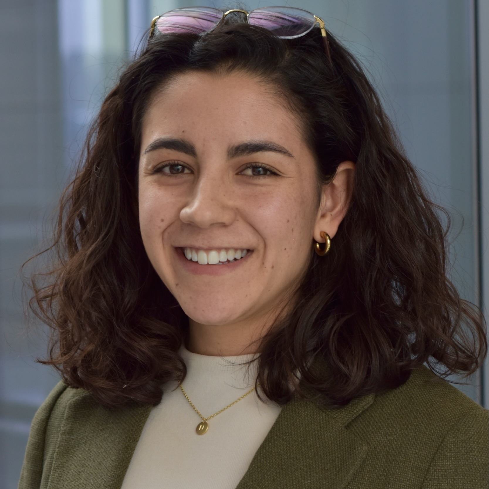
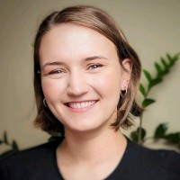

# Meet Your Faculty

<!--#### NAME

>JOB TITLE  
INSTITUTION  
LOCATION
>
> --- CONTACT INFO, IF PROVIDED

BIO GOES HERE-->

#### Ben Fisher

>Regional Coordinator, CBH Atlantic  
Canadian Bioinformatics Hub, Dalhousie University   
Halifax, NS, Canada 
>
> --- atlantic@bioinformatics.ca 

#### Larisa Morales-Soto

>Platform Manager 
Canadian Bioinformatics Hub 
Toronto, ON, Canada 
>
> --- pm@bioinformatics.ca

#### Nia Highes

>Training Manager 
Canadian Bioinformatics Hub 
Toronto, ON, Canada 
>
> --- training@bioinformatics.ca

#### Kyster Nanan

>Education Lead & Project Manager, Ontario Molecular Pathology Research Network 
Queen's University 
Kingston, ON, Canada 
>
> --- kn20@queensu.ca

#### Mohamed Helmy

>Principal Scientist and Adjunct Professor, Vaccine and Infectious Disease Organization 
University of Saskatchewan 
Kingston, ON, Canada 
>
> --- mohamed.helmy@usask.ca

